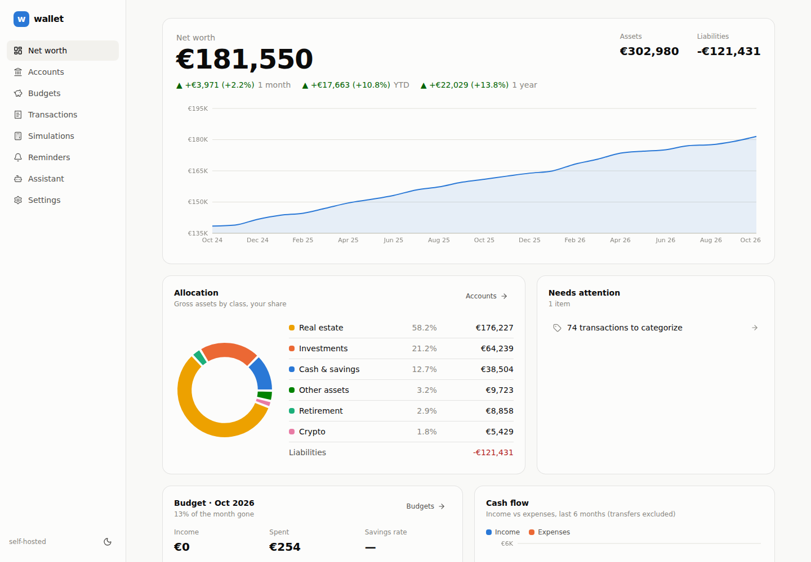
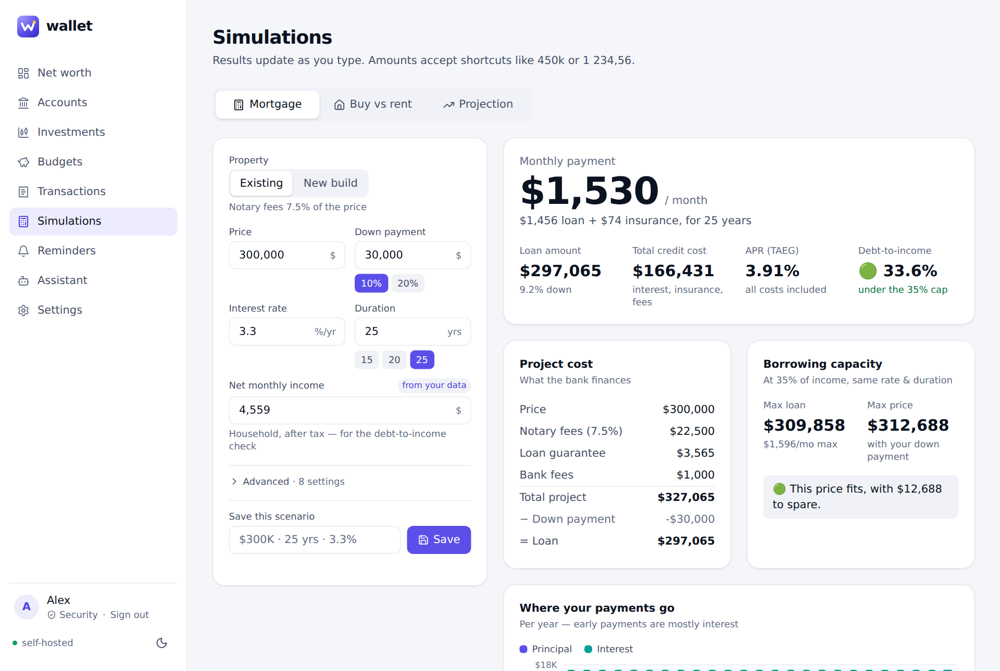
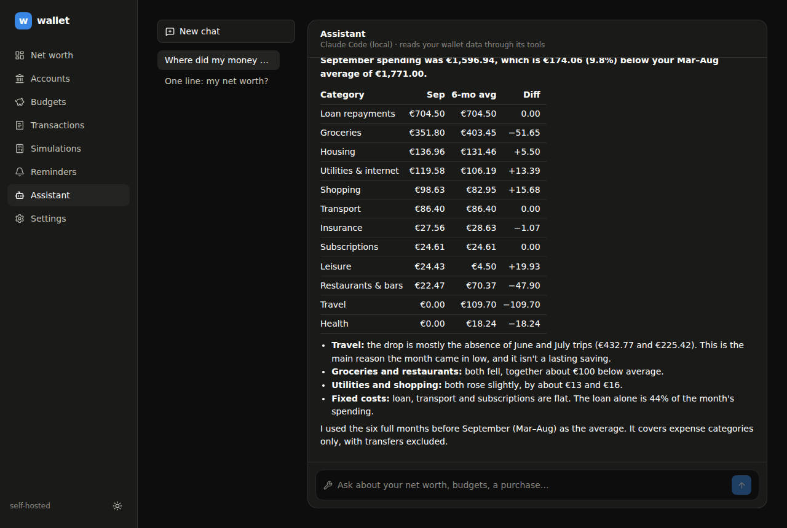

# wallet

Self-hosted personal finance tracker in the spirit of Finary: **net worth** across every asset class (cash, stocks, ETFs, crypto, gold, property, loans…), **monthly budgets**, purchase **simulations**, an **AI assistant** you can drop bank statements on, and **Telegram reminders** that nag you until your numbers are up to date.

Your data stays in one SQLite file on your machine. Sign in with a **passkey**, from this device or from your iPhone by scanning a QR code. There's no password and no OAuth.



| Simulations | Assistant |
|---|---|
|  |  |

## What it does

| | |
|---|---|
| 📈 **Net worth** | Accounts grouped by asset class: cash, investments, retirement, real estate, crypto, commodities, other, and liabilities. You get monthly history, 1M / YTD / 1Y change and allocation. It also handles ownership shares (a flat bought 50/50) and mortgages that **amortize automatically** from their loan terms. |
| 📊 **Investments** | Holdings of stocks, ETFs, funds, bonds, crypto and commodities (gold, silver…) with **daily prices** (Yahoo Finance, no key), gain vs cost basis, and allocation by type and currency. Physical assets take a manual price. |
| 💱 **Any currency** | **USD by default**. Every account, holding and transaction keeps its own currency and is converted to your base currency with **daily rates fetched for free** (currency-api with a Frankfurter/ECB fallback, no key; 200+ fiat currencies, plus BTC, ETH, XAU…). |
| 🧾 **Budgets** | Monthly envelope per category with a "spending too fast" pace marker, income / expenses / savings rate, and 12-month cash flow. Transfers between your own accounts are ignored. |
| 🏦 **Transactions** | CSV import wizard (any delimiter, decimal commas, debit/credit columns, legacy encodings) with duplicate-safe re-imports and one-click rules like "always categorize *carrefour* as Groceries". **No bank sync**: you **drop the CSV or PDF on the assistant** instead. |
| 🏠 **Simulations** | Mortgage calculator, borrowing capacity, buy-vs-rent over N years, and a net-worth projection with a Monte Carlo band and financial-independence date, all prefilled from your data. |
| 🤖 **Assistant** | Chat in the web app or on Telegram. **Drag & drop statements anywhere in the app** and it reads them (CSV, PDF, screenshots), then imports transactions, records balances and adds holdings through its tools. It runs on the Claude API **or on your local `claude` / `codex` CLI login**. The same 34 tools are exposed as an **MCP server** (stdio + HTTP) and a REST API. |
| 🔔 **Telegram** | Scheduled reminders (update balances, import the statement, monthly report…) with ✅ / snooze buttons that re-send until done. **Send a statement to the bot** and the assistant imports it. `/update` walks you through every account one question at a time. Other commands: `/networth`, `/budget`, `/balance`, `/spent`, `/ask`. |
| 👥 **Accounts** | Several people can use one install, each with their own private data. Agent SQL runs on a per-user copy, so the assistant can't read anyone else's data either. |

## Quick start

```bash
npm install
npm run dev                   # http://localhost:3000 → create your account with a passkey
```

Requires Node 22+. The database is created and migrated on first use (`./data/wallet.db`; override with `WALLET_DB_PATH`). Copy `.env.example` to `.env` to configure the assistant, Telegram and so on.

**Try it with demo data:** `npm run db:seed-demo` creates "Alex": two years of history, USD and EUR accounts, a brokerage, 401(k), PEA, crypto, gold coins and a mortgage. Then run `npm run auth:link` and open the printed link to sign in as Alex.

The monthly routine the app is built around:

1. 🔔 Telegram pings you on the 1st → tap **Update balances now** and answer one number per account. Investment accounts update themselves from market prices.
2. 📥 Drop last month's bank statement (CSV or PDF) on the assistant, or send it to the Telegram bot. It imports and categorizes it.
3. 🤖 Ask what changed: "Where did my money go this month?"

## Sign-in: passkeys

- **Create an account:** pick "Use my iPhone (QR code)" and scan the code with the iPhone camera. Face ID saves a passkey in iCloud Keychain. You can also use this device's Touch ID / Windows Hello / password manager.
- **Sign in:** same thing, one tap or one scan.
- **More devices:** go to Settings → Security → Add a passkey.
- **Lost access:** run `npm run auth:link` on the server. It prints a one-time sign-in link, valid 15 minutes.
- Passkeys need **https** or **http://localhost**, not a raw IP. Behind a reverse proxy, set `WALLET_PUBLIC_URL`.
- The first account is the owner. More people can sign up when `WALLET_ALLOW_SIGNUP=1`.

## Production (Docker)

```bash
cp .env.example .env   # WALLET_PUBLIC_URL, Telegram, ANTHROPIC_API_KEY… and WALLET_API_TOKEN if reachable from a network
docker compose up -d   # web on :3000 + Telegram worker, sharing a `wallet-data` volume
```

Without Docker, run `npm run build && npm start` for the web app and `npm run worker` for Telegram, prices and FX. Keep both running, e.g. with systemd or pm2.

Put it behind HTTPS. Pages always require a passkey session. While `WALLET_API_TOKEN` is empty, the API and MCP endpoints need **no token from this machine**, because the app is meant to run locally. Token-less calls must target a `localhost` host and can't come from another website in your browser. That blocks DNS rebinding and cross-site requests. It doesn't stop someone who can reach the port directly, so **set a token as soon as the app is reachable from a network** (and to use the API/MCP from anywhere else).

## AI assistant & agentic access

All agent surfaces share one tool registry ([`src/server/agent/tools.ts`](src/server/agent/tools.ts)):

- **Read:** overview, net worth and history, accounts, transactions, spending, budgets, cash flow, holdings, symbol search, currency conversion, read-only SQL over your own data.
- **Simulate:** mortgage, borrowing capacity, buy vs rent, projection.
- **Files:** list, read and import uploads.
- **Write:** record balances, add / import / categorize transactions, budgets, accounts, holdings, reminders.

Set `WALLET_AGENT_READONLY=1` to hide the write tools everywhere.

### 1. Built-in chat (web + Telegram)

Pick a backend with `WALLET_AGENT_PROVIDER`:

| Provider | Uses | Setup |
|---|---|---|
| `anthropic` (default) | Claude API (`claude-opus-5-5`, adaptive thinking, server-side refusal fallback). PDFs and images are sent natively. | `ANTHROPIC_API_KEY=…` or `ant auth login` |
| `claude-code` | your local Claude Code login, headless | `claude` on the PATH |
| `codex` | your local Codex login, headless | `codex` on the PATH |

Local CLI providers get the wallet MCP server as their **only** tool (no shell, no file access). They read dropped files through `read_upload`.

**Importing statements:** drop files on the chat, or anywhere in the app. You can also use the 📎 button or send them to the Telegram bot. CSVs are imported server-side with `import_csv_upload` (columns guessed, previewed with a dry run, duplicates skipped). For PDFs and screenshots, the model extracts the rows and calls `import_transactions`. Broker statements become holdings (`upsert_holding`).

### 2. MCP server: use your wallet from Claude Code, Codex, Claude Desktop…

```bash
# Claude Code (stdio), acts as the owner (or WALLET_USER_ID)
claude mcp add wallet -- node /path/to/wallet/bin/wallet-mcp.mjs

# Codex: ~/.codex/config.toml
[mcp_servers.wallet]
command = "node"
args = ["/path/to/wallet/bin/wallet-mcp.mjs"]

# Streamable HTTP: no token needed by default (local use)
claude mcp add --transport http wallet http://localhost:3000/api/mcp
# …once WALLET_API_TOKEN is set:
claude mcp add --transport http wallet https://wallet.example.com/api/mcp \
  --header "Authorization: Bearer $WALLET_API_TOKEN"
```

Opening Claude Code inside this repo picks up [`.mcp.json`](.mcp.json) automatically.

### 3. HTTP API

```bash
# Upload a statement, then ask the assistant to import it
curl -F file=@october.csv localhost:3000/api/uploads             # → [{"id":"…","kind":"csv",…}]
curl -X POST localhost:3000/api/agent -H 'Content-Type: application/json' \
  -d '{"message":"Import this into Chase checking","attachments":["<upload id>"]}'

# Call any tool directly (no LLM)
curl localhost:3000/api/tools                                    # list + JSON schemas
curl -X POST localhost:3000/api/tools/get_budget_status -H 'Content-Type: application/json' -d '{"month":"2026-09"}'
```

Add `-H "Authorization: Bearer $WALLET_API_TOKEN"` when a token is set.

## Telegram reminders

1. Create a bot with [@BotFather](https://t.me/BotFather), set `TELEGRAM_BOT_TOKEN`, and run `npm run worker`.
2. In the web app go to **Settings → Telegram → Generate link code**, then send `/start CODE` to your bot. Each user links their own chat and only ever sees their own data.
3. Create reminders in **Reminders** (presets: update balances on the 1st, import the statement on the 3rd, monthly report…). Set "re-send every 24h" and it keeps nagging until you tap ✅.

The worker also refreshes FX rates and market prices every hour. `npm run worker -- --test` sends a test message; `--once` runs a single scheduler tick (for cron).

## Concepts

- **Accounts & snapshots:** an account's balance on any date is its latest snapshot on or before that date. Loans with loan terms compute their balance from the amortization schedule. Accounts with holdings are valued from `quantity × price` today and snapshotted daily for history.
- **Currencies:** amounts are stored in their own currency (integer cents) and converted when shown, using the rate on or before each date. Rates are stored per USD and refreshed daily. A missing rate is flagged on the dashboard, never silently mixed in.
- **Liabilities** are stored as positive amounts owed and subtracted from net worth.
- **Ownership %** scales an account's contribution (joint flat, shared mortgage).
- **Categories** are `income`, `expense` or `transfer`. Transfers (e.g. "to brokerage") never count as spending.
- **Rules:** "description contains *pattern*" → category. The longest match wins. Rules apply on import and on demand.

## Development

```bash
npm test            # vitest: finance math, services, multi-user isolation, FX, holdings, passkeys (software authenticator), Telegram bot, agent loop
npm run typecheck
npm run db:generate # after editing src/server/db/schema.ts
```

```
src/
  app/               Next.js pages + API routes (/api/auth, /api/agent, /api/uploads, /api/mcp, /api/tools, /api/export)
  components/        UI primitives, charts, brand
  lib/               pure code: money, dates, CSV import, schedules, finance/ (loan, mortgage, buy-vs-rent, projection)
  server/
    db/              drizzle schema + SQLite client (auto-migrates)
    services/        domain logic (users, passkeys, accounts, holdings, prices, fx, net worth, budgets, transactions, uploads…)
    agent/           tool registry, prompt, attachments, per-user SQL sandbox, providers (Claude API, local CLIs), MCP server
    telegram/        bot API client, commands, file intake, reminder scheduler
  bin/               worker (Telegram + prices + FX), mcp (stdio), seed-demo, login-link, migrate
bin/wallet-mcp.mjs   MCP launcher that works from any directory
```

## Roadmap ideas

- Budget overrides per month and rollover envelopes.
- Dividends and realized gains from broker statements.
- Shared household views (joint accounts across two users).
