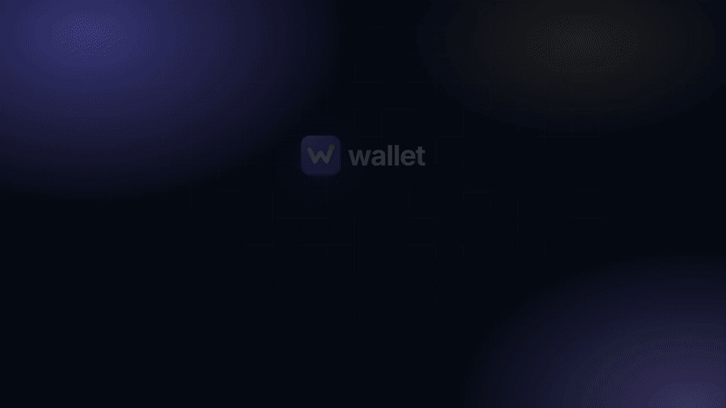

<p align="center">
  
</p>
<h1 align="center">wallet</h1>
<p align="center"><b>Your money, on your machine.</b><br>
Net worth, budgets and investments in any currency, with an AI assistant you can drop bank statements on.<br>
Self-hosted · one SQLite file · passkey sign-in · MIT</p>

<p align="center">
  <a href="https://clanker-labs.github.io/wallet/"><b>Docs & demos</b></a> ·
  <a href="https://clanker-labs.github.io/wallet/media/demo.mp4">Full demo (video)</a> ·
  <a href="https://clanker-labs.github.io/wallet/getting-started.html">Get started</a> ·
  <a href="https://clanker-labs.github.io/wallet/architecture.html">How it works</a>
</p>

<p align="center">
  <a href="https://clanker-labs.github.io/wallet/"></a>
</p>

## What it does

- **Net worth** across cash, stocks, retirement, property, crypto, gold and loans. Monthly history, allocation, and partly-owned assets. Mortgages amortize on their own.
- **Any currency.** USD by default. Every account, holding and transaction keeps its own currency, converted daily with free exchange rates.
- **Investments.** Stocks, ETFs, funds, crypto and commodities with daily prices and gains. Physical gold takes a manual price.
- **Budgets.** Monthly envelopes with a pace marker, savings rate and cash flow.
- **Drop a statement, it's imported.** CSV, PDF or a screenshot, anywhere in the app or sent to the Telegram bot. The assistant runs on the Claude API, or on your local `claude` / `codex` login.
- **MCP & API.** The same 34 tools for Claude Code, Codex, Claude Desktop or plain HTTP. No token needed on localhost.
- **Telegram reminders** re-send until you tap ✅. `/update` asks for one balance at a time.
- **Simulations** for mortgages, borrowing capacity, buy vs rent, and a net-worth projection.
- **Passkeys only.** Face ID on your iPhone through a QR code; no passwords, no OAuth. Several users per install, each with private data.

Every feature has a short video on the [docs site](https://clanker-labs.github.io/wallet/).

## Quick start

```bash
npm install
npm run dev          # http://localhost:3000 → create your account with a passkey
```

Want to look around first? Load the demo data, then open the one-time sign-in link it prints:

```bash
npm run db:seed-demo && npm run auth:link
```

Node 22+. For Docker, Telegram, the assistant and HTTPS (passkeys need it outside localhost), see [Getting started](https://clanker-labs.github.io/wallet/getting-started.html) and [Configuration](https://clanker-labs.github.io/wallet/configuration.html).

## Docs

| | |
|---|---|
| [Features](https://clanker-labs.github.io/wallet/) | Each page has its demo video: net worth, accounts, investments, budgets, transactions, assistant, simulations, Telegram, settings |
| [Architecture](https://clanker-labs.github.io/wallet/architecture.html) | Layers, request flow, multi-user isolation |
| [Security](https://clanker-labs.github.io/wallet/security.html) | Passkeys, sessions, the local-only token-less API, the agent's SQL sandbox |
| [Agent tools](https://clanker-labs.github.io/wallet/tools.html) · [HTTP API](https://clanker-labs.github.io/wallet/api.html) | Generated from the code |
| [Data model](https://clanker-labs.github.io/wallet/data-model.html) · [Configuration](https://clanker-labs.github.io/wallet/configuration.html) | Every table and every environment variable |

## Development

```bash
npm test                 # vitest
npm run typecheck
npm run site:build       # docs site → site-dist/
node scripts/demo/record-all.mjs   # re-record the demo videos (see scripts/demo/README.md)
```

Next.js 16 · React 19 · SQLite (better-sqlite3 + drizzle) · Tailwind v4 · Recharts. Notes for coding agents are in [AGENTS.md](AGENTS.md).
